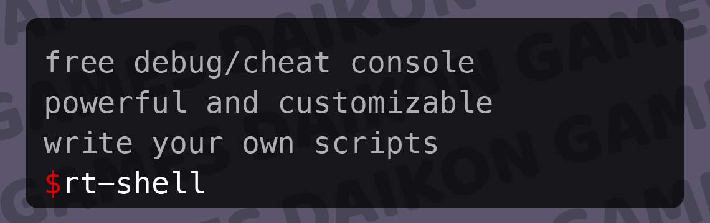
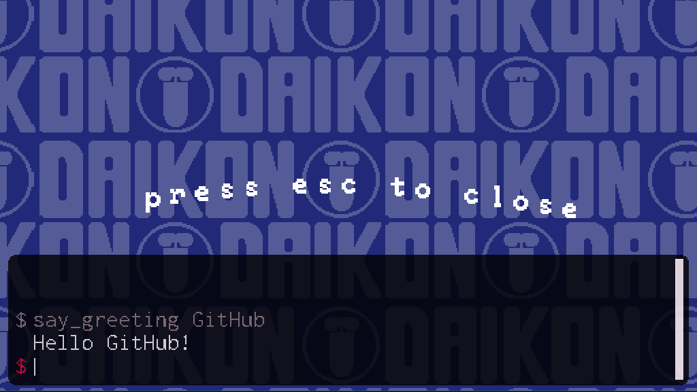

# rt-shell


rt-shell, or **r**un-**t**ime **shell** an easy-to-use, customizable, and extensible cheat/debug console for GameMaker Studio 2.3+.

## Setup

Integrating rt-shell into your project is simple: just [download the latest release](https://github.com/daikon-games/rt-shell/releases), and then in GameMaker Studio click on the **Tools** menu and select **Import Local Package**. Choose the `.yymps` file you downloaded, and import all assets.

Alternatively you can install rt-shell from the [Game Maker Marketplace](https://marketplace.yoyogames.com/assets/9485/rt-shell).

The `obj_shell` object is a persistent object, so you only need to include or create it once, though it is smart enough to automatically handle excess instances. The default way to open the shell is `Ctrl + Shift + C`, and it can be closed by pressing `Esc`.

## Writing Your Own Shell Scripts

rt-shell will execute any global scripts whose names start with `sh_`. You can see the example scripts included with the test project in [`scr_shell_scripts.gml`](rt-shell/scripts/scr_shell_scripts/scr_shell_scripts.gml).

Let's write a simple "Hello World" script together. We first need a place to create the function, so create a Script asset in your project. The name of this asset isn't important, but we can call it `scr_shell_scripts` as I have done in the test project.

Now let's write our function! We want it to take an argument as input, and print "Hello [argument]!" to the console. Like so:



Our function needs to start with `sh_`, so let's call it `sh_helloworld`. As you can see in the example screenshot above, you do not include the `sh_` when calling the function.

rt-shell functions take an array called `args` as an argument, and any arguments passed to the function at the console are present in this array in GML. `args[0]` always contains the name of the function, as in typical shell programming, and `args[1]` and onwards are the real arguments passed in.

rt-shell functions can optionally return a string, and if they do that string will be printed to the console.

With all that said, here's our final hello world function:

```
function sh_helloworld (args) {
	return "Hello " + args[1] + "!";
}
```

Simple, right? With that function in place, you can call `helloworld` from the shell as you saw in the screenshot above. I'm sure you can think of all sorts of scripts that would come in handy for debugging and testing your game. How about a script that set's the player's max health, or money counter? A script that spawns an enemy or a treasure item? Experiment and have fun, happy developing!

## Configuring rt-shell

The following variables on the `obj_shell` object can be configured. They are defined on the object's `Variable Definitions` panel in the IDE. It is recommended that you instantiate `obj_shell` programatically and then set these parameters on the created instance via code. This way you can upgrade to a newer version of rt-shell without having to re-configure your shell object!

### Appearance Configuration

| variable | definition | default |
|----------|------------|---------|
| `width`  | The width, in GUI pixels, of the shell | 500 |
| `height` | The height, in GUI pixels, of the shell | 96 |
| `screenAnchorPoint` | The location on the screen to anchor the console to, as a string. Possible values are `"top"` or `"bottom"`. | `"bottom"` |
| `anchorMargin` | The number of pixels away from the anchor point to draw the shell. In practice, the margin from the top or bottom of the screen, depending on how you have set `screenAnchorPoint` | 4
| `prompt` | A character or string to print as a command prompt | $ |
| `promptColor` | The font color to draw the prompt, as a GML expression | `make_color_rgb(237, 0, 54)` |
| `consoleColor` | The background color of the console itself, as a GML expression | `c_black` |
| `consoleAlpha` | The opacity of the console itself, 0.0 being fully transparent and 1.0 being fully opaque | 0.9 |
| `consoleFont` | The GML font resource to draw all the console text with. The default is included with the package, and uses the Raph Levien's "Inconsolata" font | `font_console` |
| `fontColor` | The font color to draw all console text with, as a GML expression | `make_color_rgb(255, 242, 245)` |
| `fontColorSecondary` | The font color to draw suggestions and history with, as a GML expression | `make_color_rgb(140, 118, 123)` |
| `cornerRadius` | The radius in pixels to round the corners of the shell. A value of 0 would result in perfectly squared corners | 12 |

You can see examples of various ways to customize the shell's appearance on the [Theme Gallery](THEMING.md) page!

### Other Configuration

| variable | definition | default |
|----------|------------|---------|
| `openKey` | The key that opens the console, in combination with the `modifierKeys` if any. Must be a letter A-Z or a numeral 0-9 (see  [`ord()`](https://manual.yoyogames.com/index.htm#t=GameMaker_Language%2FGML_Reference%2FStrings%2Ford.htm)) | C |
| `modifierKeys` | A multi-select of special keys. All the selected keys must be pressed in combination with `openKey` to open the console | `vk_control`, `vk_shift` |
| `openFunction` | A reference to a function that will be executed every time the shell is opened. Could be used to pause the game when the shell opens, for example | `undefined` |
| `closeFunction` | A reference to a function that will be executed every time the shell is closed. Could be used to unpause the game when the shell closes, for example | `undefined` |
