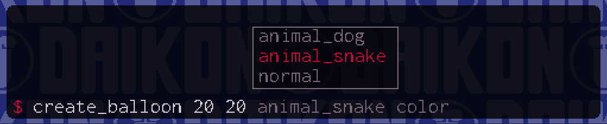

# rt-shell


rt-shell, or **r**un-**t**ime **shell** an easy-to-use, customizable, and extensible cheat/debug console for GameMaker Studio 2.3+.

#### Table of Contents
* [Setup](#setup)
* [Writing Your Own Shell Commands](#writing-your-own-shell-commands)
* [Adding Command Metadata](#adding-command-metadata)
* [Configuring rt-shell](#configuring-rt-shell)
* [Licensing](#licensing)
* [Attribution](#attribution)

## Setup

Integrating rt-shell into your project is simple: just [download the latest release](https://github.com/daikon-games/rt-shell/releases), and then in GameMaker Studio click on the **Tools** menu and select **Import Local Package**. Choose the `.yymps` file you downloaded, and import all assets.

Alternatively you can install rt-shell from the [Game Maker Marketplace](https://marketplace.yoyogames.com/assets/9485/rt-shell).

The `obj_shell` object is a persistent object, so you only need to include or create it once, though it is smart enough to automatically handle excess instances. The default way to open the shell is `Ctrl + Shift + C`, and it can be closed by pressing `Esc`.


## Writing Your Own Shell Commands

rt-shell will execute any global scripts whose names start with `sh_`. You can see the example scripts included with the test project in [`scr_shell_scripts.gml`](rt-shell/scripts/scr_shell_scripts/scr_shell_scripts.gml).

Let's write a simple "Hello World" commands together. We first need a place to create the function, so create a Script asset in your project. The name of this asset isn't important, but we can call it `scr_shell_scripts` as I have done in the test project.

Now let's write our function! We want it to take an argument as input, and print "Hello [argument]!" to the console. Like so:


Our function needs to start with `sh_`, so let's call it `sh_say_greeting`. As you can see in the example screenshot above, you do not include the `sh_` when calling the function.

rt-shell functions take an array called `args` as an argument, and any arguments passed to the function at the console are present in this array in GML. `args[0]` always contains the name of the function, as in typical shell programming, and `args[1]` and onwards are the real arguments passed in.

rt-shell functions can optionally return a string, and if they do that string will be printed to the console.

With all that said, here's our final hello world function:

```gml
function sh_say_greeting (args) {
	return "Hello " + args[1] + "!";
}
```

Simple, right? With that function in place, you can call `say_greeting` from the shell as you saw in the screenshot above. I'm sure you can think of all sorts of commands that would come in handy for debugging and testing your game. How about a script that set's the player's max health, or money counter? A script that spawns an enemy or a treasure item? Experiment and have fun, happy developing!

## Adding Command Metadata

rt-shell provides a way for you to add metadata to your commands. This will let you see possible arguments and autocomplete suggestions within the shell, as well as let you plug into the shell's built-in `help` commands to document your own functions!

Adding metadata works much the same way as adding your custom commands in the first place. You simply create a new function that begins with `meta_` followed by the name of your function. For instance, if you had a function `sh_create_balloon` then you could add metadata by creating another function `meta_create_balloon`. The part of the name after `sh_` and after `meta_` must match exactly for them to be linked.

Let's say that `sh_create_balloon` looked like this:
```gml
function sh_create_balloon (args) {
	var balloon = instance_create_layer(args[1], args[2], "balloon_layer", obj_balloon);
	balloon.type = args[3];
	balloon.color = args[4];
}
```

You can see that it takes four arguments: X/Y coordinates and two arguments defining a type and color. We can then make an associated metadata function. Every metadata function should return a struct with a specific format, as you can see:
```gml
function meta_create_balloon() {
	return {
		description: "create a balloon",
		arguments: ["x", "y", "type", "color"],
		suggestions: [
			[],
			[],
			["normal", "animal_dog", "animal_snake"],
			["pink", "blue", "brown", "green"]
		],
		argumentDescriptions: [
			"the X coordinate to create the balloon at",
			"the Y coordinate to create the balloon at",
			"the type of balloon to create",
			"the color of the balloon"
		]
	}
}
```
When you go to type your script into the shell your argument hints will show up like so:


and so will your autocompletion suggestions:



The command will also display the arguments and description fields when running `help create_balloon`.

Some things to keep in mind:

1. The function names must match after the `sh_` and `meta_` prefixes.
2. The order of the array items in `arguments`, `suggestions`, and `argumentDescriptions` must line up
3. If suggestions aren't needed for an argument (like for `x` or `y` above), just input a blank array `[]`
4. `description` and `argumentDescriptions` are optional, they're only used for the `help` output

## Configuring rt-shell

The following variables on the `obj_shell` object can be configured. They are defined on the object's `Variable Definitions` panel in the IDE. It is recommended that you instantiate `obj_shell` programatically and then set these parameters on the created instance via code. This way you can upgrade to a newer version of rt-shell without having to re-configure your shell object!

### Appearance Configuration

| variable | definition | default |
|----------|------------|---------|
| `width`  | The width, in GUI pixels, of the shell | 500 |
| `height` | The height, in GUI pixels, of the shell | 96 |
| `screenAnchorPointV` | The vertical location on the screen to anchor the console to, as a string. Possible values are `"top"`, `"middle"`, or `"bottom"`. | `"bottom"` |
| `screenAnchorPointH` | The horizontal location on the screen to anchor the console to, as a string. Possible values are `"left"`, `"center"`, or `"right"`. | `"center"` |
| `anchorMargin` | The number of pixels away from the anchor point to draw the shell. In practice, the margin from the top or bottom of the screen, depending on how you have set `screenAnchorPoint` | 4 |
| `consolePadding` | The number of pixels of padding to place around the edges of the shell window. | 6 |
| `prompt` | A character or string to print as a command prompt | $ |
| `promptColor` | The font color to draw the prompt, as a GML expression | `make_color_rgb(237, 0, 54)` |
| `consoleColor` | The background color of the console itself, as a GML expression | `c_black` |
| `consoleAlpha` | The opacity of the console itself, 0.0 being fully transparent and 1.0 being fully opaque | 0.9 |
| `consoleFont` | The GML font resource to draw all the console text with. The default is included with the package, and uses the Raph Levien's "Inconsolata" font | `font_console` |
| `fontColor` | The font color to draw all console text with, as a GML expression | `make_color_rgb(255, 242, 245)` |
| `fontColorSecondary` | The font color to draw suggestions and history with, as a GML expression | `make_color_rgb(140, 118, 123)` |
| `cornerRadius` | The radius in pixels to round the corners of the shell. A value of 0 would result in perfectly squared corners | 12 |
| `scrollBarWidth` | The width in pixels of the scrollbar. | 5 |
| `autocompleteBackgroundColor` | The background color of the autocompletion box, as a GML expression | `c_black` |

You can see examples of various ways to customize the shell's appearance on the [Theme Gallery](THEMING.md) page!

### Other Configuration

| variable | definition | default |
|----------|------------|---------|
| `openKey` | The key that opens the console, in combination with the `modifierKeys` if any. In the form of an expression. | `ord("C")` |
| `openModifiers` | A multi-select of special keys for use with `openKey`. All the selected keys must be pressed in combination with `openKey` to open the console | `vk_control`, `vk_shift` |
| `openFunction` | A reference to a function that will be executed every time the shell is opened. Could be used to pause the game when the shell opens, for example | `undefined` |
| `closeFunction` | A reference to a function that will be executed every time the shell is closed. Could be used to unpause the game when the shell closes, for example | `undefined` |
| `enableAutoComplete` | Whether or not to use the new autocompletion box. Marking this false will only provide in-line completion suggestions. | `true` |
| `cycleSuggestionsKey` | The key for cycling through suggestions for autocompletion. In the form of an expression. | `vk_tab` |
| `cycleSuggestionsModifiers` | A multi-select of special keys for use with `cycleSuggestionsKey`. All the selected keys must be pressed in combination with `cycleSuggestionsKey` to cycle the suggestions. | `None` |
| `cycleSuggestionsReverseKey` | The key for cycling through suggestions for autocompletion in reverse order. In the form of an expression. | `vk_tab` |
| `cycleSuggestionsReverseModifiers` | A multi-select of special keys for use with `cycleSuggestionsReverseKey`. All the selected keys must be pressed in combination with `cycleSuggestionsReverseKey` to cycle the suggestions in reverse. | `vk_shift` |
| `historyUpKey` | The key for cycling up through the command history. In the form of an expression. | `vk_up` |
| `historyUpModifiers` | A multi-select of special keys for use with `historyUpKey`. All the selected keys must be pressed in combination with `historyUpKey` to cycle the history up. | `None` |
| `historyDownKey` | The key for cycling down through the command history. In the form of an expression. | `vk_down` |
| `historyDownModifiers` | A multi-select of special keys for use with `historyUpKey`. All the selected keys must be pressed in combination with `historyUpKey` to cycle the history down. | `None` |
| `keyRepeatInitialDelay` | The amount of time in frames to wait after pressing and holding a key before it begins to repeat. | 25 |
| `keyRepeatDelay` | The amount of time in frames to wait between each repeat of a held key. | 4 |
| `scrollSpeed` | The number of pixels at a time to scroll the console when moving the mouse wheel. | 16 |
| `scrollSmoothness` | How smooth you want the scrolling to be when moving the mouse wheel. A number between 0 - 1. | 0.5 |

## Licensing

rt-shell is licensed under Creative Commons BY 4.0. Essentially, you may use it, change it, ship it, and share it, with attribution.
Just make sure to somewhere mention the use of **rt-shell by Daikon Games**!

## Attribution
### Fonts
Default shell font, [Consolas](https://docs.microsoft.com/en-us/typography/font-list/consolas) © 2018 Microsoft Corporation. All rights reserved.
Demo font, [Peaberry](https://emhuo.itch.io/peaberry-pixel-font) by emhuo
