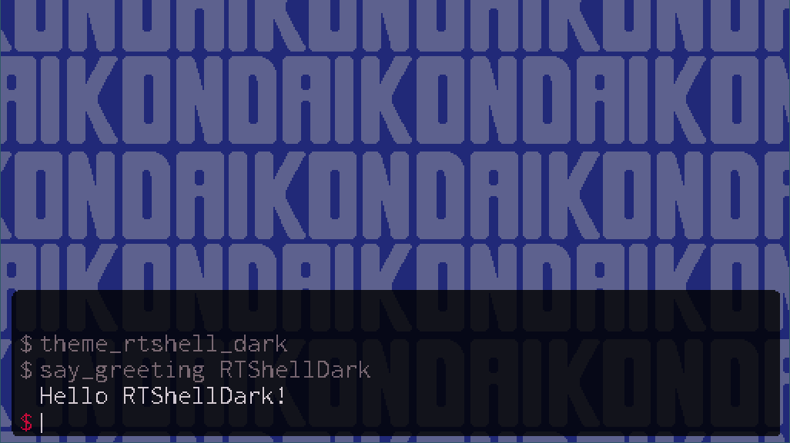
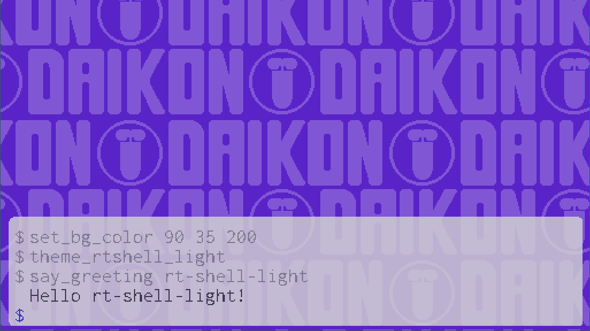
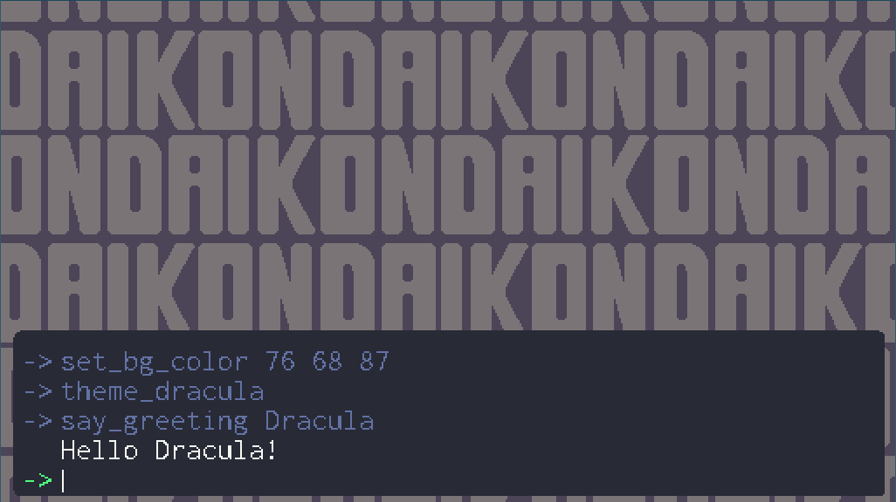
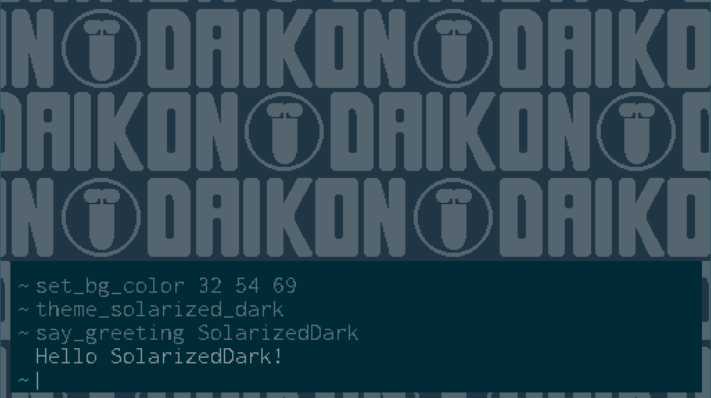
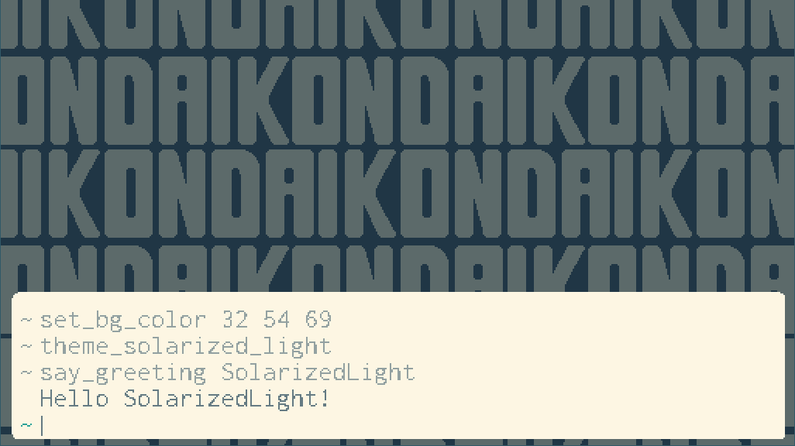

# Theme Gallery
rt-shell is customizable in a number of ways. On this page you can see a variety of
themes created using the available customization options.

Come up with your own great theme, and want it featured here? Get in touch on [Twitter](https://twitter.com/daikonsoftware)!

<table>
<tr>
<td>
<b>rt-shell-dark</b> 
  
The default rt-shell theme 
<pre><code>obj_shell.consoleAlpha = 0.9;
obj_shell.consoleColor = c_black;
obj_shell.fontColor = make_color_rgb(255, 242, 245);
obj_shell.fontColorSecondary = make_color_rgb(140, 118, 123);
obj_shell.promptColor = make_color_rgb(237, 0, 54);
obj_shell.prompt = "$";</code></pre> 
<td>
<b>rt-shell-light</b> 
  
A light version of the default rt-shell theme 
<pre><code>obj_shell.consoleAlpha = 0.9;
obj_shell.consoleColor = make_color_rgb(235, 235, 235);
obj_shell.fontColor = make_color_rgb(40, 40, 45);
obj_shell.fontColorSecondary = make_color_rgb(120, 120, 128);
obj_shell.promptColor = make_color_rgb(29, 29, 196);
obj_shell.prompt = "$";</code></pre> 
<tr>
<td>
<b>ocean-blue</b> 
  
A cobalt gray and ocean blue theme 
<pre><code>obj_shell.consoleAlpha = 1;
obj_shell.consoleColor = make_color_rgb(29, 31, 33);
obj_shell.fontColor = make_color_rgb(197, 200, 198);
obj_shell.fontColorSecondary = make_color_rgb(116, 127, 140);
obj_shell.promptColor = make_color_rgb(57, 113, 237);
obj_shell.prompt = "%";</code></pre> 
<td>
<b>dracula</b> 
  
The popular <a href="https://draculatheme.com/">Dracula theme</a>! 
<pre><code>obj_shell.consoleAlpha = 1;
obj_shell.consoleColor = make_color_rgb(40, 42, 54);
obj_shell.fontColor = make_color_rgb(248, 248, 242);
obj_shell.fontColorSecondary = make_color_rgb(98, 114, 164);
obj_shell.promptColor = make_color_rgb(80, 250, 123);
obj_shell.prompt = "->";</code></pre> 
<tr>
<td>
<b>solarized-dark</b> 
  
The popular <a href="https://ethanschoonover.com/solarized/">Solarized Dark theme</a>! 
<pre><code>obj_shell.consoleAlpha = 1;
obj_shell.consoleColor = make_color_rgb(0, 43, 54);
obj_shell.fontColor = make_color_rgb(131, 148, 150);
obj_shell.fontColorSecondary = make_color_rgb(88, 110, 117);
obj_shell.promptColor = make_color_rgb(42, 161, 152);
obj_shell.prompt = "~";</code></pre> 
<td>
<b>solarized-light</b> 
  
The popular <a href="https://ethanschoonover.com/solarized/">Solarized Light theme</a>! 
<pre><code>obj_shell.consoleAlpha = 1;
obj_shell.consoleColor = make_color_rgb(253, 246, 227);
obj_shell.fontColor = make_color_rgb(101, 123, 131);
obj_shell.fontColorSecondary = make_color_rgb(147, 161, 161);
obj_shell.promptColor = make_color_rgb(42, 161, 152);
obj_shell.prompt = "~";</code></pre> 
